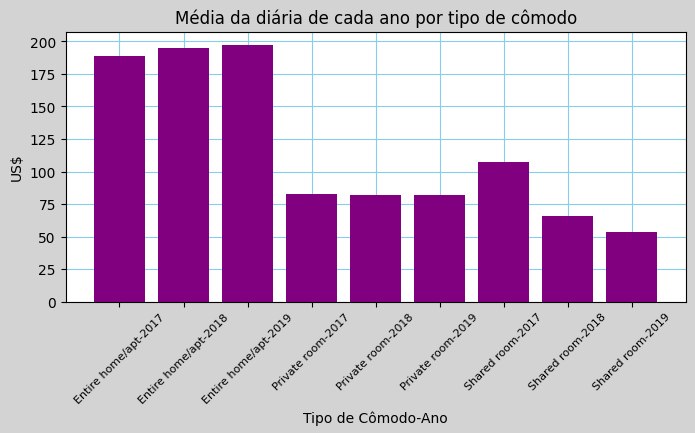
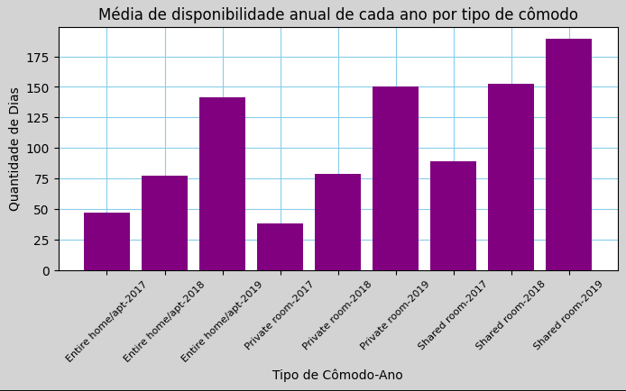
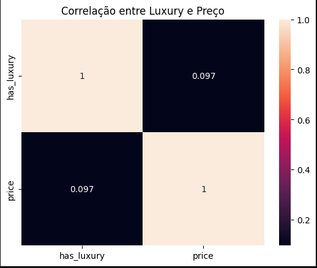

# Análise de Preços de Diárias de Estabelecimentos em Nova York

Este projeto visa analisar e prever os preços de diárias de estabelecimentos em Nova York. O estudo inclui processamento de dados, validação de hipóteses, modelagem preditiva e avaliação de métricas.

---

## Conteúdo
1. [Instalação](#instalação)
2. [Uso](#uso)
3. [Principais Funcionalidades](#principais-funcionalidades)
4. [Hipóteses e Validações](#hipóteses-e-validações)
5. [Análise de Métricas de Avaliação](#análise-de-métricas-de-avaliação)
6. [Resultados](#resultados)
7. [Melhorias Futuras](#melhorias-futuras)
8. [Licença](#licença)
9. [Contato](#contato)

---

# 1.0 Instalação

### Pré-requisitos
- Python 3.8+
- Git

### 1.1 Instalação do Projeto

1. **Clone o repositório na pasta desejada:**
   ```bash
   git clone https://github.com/gustavobastos1998/New-York-Rent-Prediction.git
   ```
2. **Abra a pasta onde está o repositório:**
   Pelo terminal, navegue até o diretório certo usando o comando `cd`

3. **Configuração do Ambiente Virtual**
   Para evitar conflito de versões do python, sugiro que use um **ambiente virtual**

### **Criando e ativando o ambiente virtual**

1. **Crie um ambiente virtual** (chamado `venv`) executando o seguinte comando no terminal:

   **No Windows:**
   ```bash
   python -m venv venv
   ```
   **No macOS/Linux:**
   ```bash
   python3 -m venv venv
   ```
2. **Ative o ambiente virtual**:
   **No Windows (cmd ou powershell):**
   ```bash
   venv\Scripts\activate
   ```
   **No Windows (cmd ou powershell):**
   ```bash
   source venv/bin/activate
   ```
4. **Instalando dependências:**
   Com o ambiente virtual ativado, instale todas as dependências utilizando o **`requirements.txt`**:
   ```bash
   pip install -r requirements.txt
   ```

# 2.0 Uso

## Execução do Notebook:

O notebook lighthouse-notebook-teste.ipynb contém todas as etapas do projeto.

# 3.0 Principais Funcionalidades

## **3.1 Processamento de dados**
- Padronização dos nomes das colunas
- Criação de novas colunas
- Identificação e exclusão de valores ausentes
- Modificação dos tipos de dados para seus valores corretos

## **3.2 Análise exploratória**
- Identificação de Estabelecimentos bons para alugar
- Análise de Disponibilidade e Preço por Tipo de Acomodação e Ano

## **3.3 Modelagem preditiva**
- Regressão Linear
- Random Forest
- Lasso
- Ridge
- ElasticNet
- HuberRegressor

# 4.0 Hipóteses e Validações

## População dos distritos (2011-2019)
A escolha dos anos são referentes a única coluna de data, **`last_review`** que varia de **2011-03-28** a **2019-07-08**.

| Ano   | Manhattan   | Brooklyn    | Queens      | Bronx       | Staten Island |
|-------|-------------|-------------|-------------|-------------|---------------|
| 2011  | 1.605.000   | 2.565.000   | 2.275.000   | 1.395.000   | 470.000       |
| 2012  | 1.630.000   | 2.580.000   | 2.490.000   | 1.496.000   | 475.000       |
| 2013  | 1.635.000   | 2.595.000   | 2.305.000   | 1.415.000   | 480.000       |
| 2014  | 1.650.000   | 2.610.000   | 2.320.000   | 1.425.000   | 485.000       |
| 2015  | 1.465.000   | 2.625.000   | 2.335.000   | 1.453.000   | 490.000       |
| 2016  | 1.680.000   | 2.640.000   | 2.350.000   | 1.445.000   | 495.000       |
| 2017  | 1.695.000   | 2.655.000   | 2.365.000   | 1.455.000   | 500.000       |
| 2018  | 1.710.000   | 2.670.000   | 2.390.000   | 1.465.000   | 505.000       |
| 2019  | 1.725.000   | 2.685.000   | 2.295.000   | 1.475.000   | 510.000       |

## Hipótese 1: Distritos mais populosos têm preços mais baixos

### Média das diárias de cada distrito

| Distrito       | Diária Média  | Ranqueamento |
|----------------|---------------|--------------|
| Bronx          | 79.558857     | 5            |
| Brooklyn       | 121.461613    | 2            |
| Manhattan      | 180.071596    | 1            |
| Queens         | 95.783683     | 3            |
| Staten Island  | 89.964968     | 4            |

**Conclusão**: Manhattan é o distrito mais caro, enquanto o Bronx é o mais barato. Hipótese rejeitada.

## Hipótese 2: O ranqueamento de preços se mantém quando consideramos o **"preço real"** (preço da diária multiplicado pelo número mínimo de noites necessárias)

### Preço real médio de cada distrito

| Distrito       | Preço Real Médio | Ranqueamento |
|----------------|------------------|--------------|
| Bronx          | 289.017143       | 5            |
| Brooklyn       | 653.465872       | 2            |
| Manhattan      | 1328.286746      | 1            |
| Queens         | 579.924541       | 3            |
| Staten Island  | 311.729299       | 4            |

**Conclusão**: Manhattan continua sendo o distrito mais caro, e o Bronx permanece como o mais barato. A hipótese 2 está correta.

## Hipótese 3: Quartos compartilhados são mais baratos e disponíveis.



**Conclusão**: Quartos compartilhados têm menor preço e estão mais disponíveis. Hipótese 3 está correta.

## Hipótese 4: A palavra "Luxury" no nome afeta o preço

**Conclusão**: Apesar de terem diárias em média mais caras, não há correlação estatística significativa. Hipótese 4 descartada.

# 5.0 Análise de Métricas de Avaliação

| Modelo               | Métrica | Antes (Com Outliers)       | Depois (Sem Outliers)      |
|----------------------|---------|----------------------------|----------------------------|
| **LinearRegression** | MAE     | 62.61                      | 61.49                      |
|                      | RMSE    | 182.72                     | 147.88                     |
|                      | R²      | 0.1019                     | 0.1777                     |
|                      | R² Treino | 0.1108                   | 0.1394                     |
|                      | MAPE    | 51.93%                     | 50.25%                     |
| **Lasso**            | MAE     | 62.57                      | 61.43                      |
|                      | RMSE    | 182.58                     | 147.91                     |
|                      | R²      | 0.1033                     | 0.1774                     |
|                      | R² Treino | 0.1106                   | 0.1392                     |
|                      | MAPE    | 51.89%                     | 50.19%                     |
| **HuberRegressor**   | MAE     | 83.45                      | 90.70                      |
|                      | RMSE    | 202.71                     | 179.22                     |
|                      | R²      | -0.1053                    | -0.2078                    |
|                      | R² Treino | -0.0966                  | -0.1803                    |
|                      | MAPE    | 62.33%                     | 66.22%                     |
| **RandomForestRegressor** | MAE | 57.22                  | 56.77                      |
|                      | RMSE    | 171.85                     | 153.74                     |
|                      | R²      | 0.2056                     | 0.1112                     |
|                      | R² Treino | 0.3804                   | 0.3940                     |
|                      | MAPE    | 43.65%                     | 42.46%                     |
| **Ridge**            | MAE     | 62.60                      | 61.49                      |
|                      | RMSE    | 182.72                     | 147.88                     |
|                      | R²      | 0.1019                     | 0.1777                     |
|                      | R² Treino | 0.1108                   | 0.1394                     |
|                      | MAPE    | 51.93%                     | 50.24%                     |
| **ElasticNet**       | MAE     | 64.40                      | 63.71                      |
|                      | RMSE    | 183.76                     | 150.35                     |
|                      | R²      | 0.0916                     | 0.1500                     |
|                      | R² Treino | 0.0946                   | 0.1202                     |
|                      | MAPE    | 55.31%                     | 53.79%                     |

# 6.0 Resultados

## Melhor Modelo:

- **RandomForestRegressor** teve o menor MAE (56.77) e MAPE (42.46%).
- Entretanto, apresenta overfitting (R² Treino = 0.3940 vs. R² Teste = 0.1112).

## Impacto da Remoção de Outliers:

- Redução de ~20% no RMSE para modelos lineares.
- Aumento de ~7% no R² para LinearRegression.

# 7.0 Melhorias Futuras

## Normalização de Dados

Testar MinMaxScaler ou PowerTransformer para melhorar métricas.

## Tratamento de Outliers

Usar técnicas como Winsorization em vez de remoção direta.

## Ajuste de Hiperparâmetros

Utilizar GridSearchCV para otimizar modelos como RandomForestRegressor.

## Novos Modelos

Implementar algoritmos como XGBoost ou redes neurais.


# 8.0 Licença

Distribuído sob a licença MIT. Veja LICENSE para mais detalhes.

# 9.0 Contato

- **Autor**: Gustavo de Souza Bastos
- **Email**: gustavodsb25@gmail.com
- **LinkedIn**: https://www.linkedin.com/in/gustavo-bastos-ds/